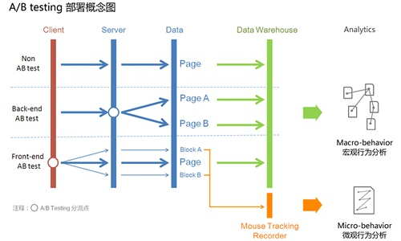

## 基本概念

### 关于A/B测试

所谓A/B测试，简单来说，就是为同一个目标制定两个方案。让一部分流量使用A方案，另一部分流量使用B方案。并对比两个方案的最终运营数据，看哪个方案更符合设计目标。

A/B测试的大致流程如下:

从图中可以看出A/B测试的四个关键角色:

- 客户端(Client)
- 服务器(Server)
- 数据层(Data)
- 数据仓库(Data Warehouse)

以及三种访问形式:

- 无A/B测试的普通访问流程(Non AB test)
- 基于后端的A/B测试访问流程(Back-end AB test)
- 基于前端的A/B测试访问流程(Front-end AB test)

### 关键技术

A/B Test的关键在于"分流"。从上图中我们可以看到，分流可以在客户端做，也可以在服务器端做。由于PTS部门项目均位于服务层，所以我们选择在SOA层(服务端)进行分流

### A/B Testing & 灰度分布 & 多变量测试

- AB test是一种灰度发布方式，比较注重两种方案之间的测试比较。重点是在几种方案中选择最优方案
- 灰度测试一般是在已有产品功能升级上的测试比较。是对某一产品的发布逐步扩大使用群体范围，也叫灰度放量
- 多变量测试(Multivariate Testing)，和A/B Test的区别在于多变量测试涉及到多种场景的比较，其中的变量有多个，而A/B Test通常只有一个变量。

## 功能模块设计及实现

### 分流模块

分流开始于`Dispatcher`(请求入口)，分流粒度为`接口级别`，使用装饰器将满足特定条件的请求

- 从`被装饰的接口(A)`分流至`新的接口(B)`
- 或者使用不同参数请求原接口

工作流程如下:

请求 => 解析分流规则 => 分流

### 规则管理模块

用于对分流维度和规则进行管理和解析。

#### 分流维度

- city_id
- rst_id
- user_id
- order_id

#### 分流规则

- 范围分流(range)
- 百分比分流(percent)
- 特定规则分流(based on split function)
- 特定值分流(huskar configs)

### 分流规则解析模块

分流规则体现在装饰器的参数中。解析模块用于对分流规则进行解析，将符合条件的请求分流

### 统计及展示模块

暂不考虑`统计模块`及`展示模块`的设计，运营数据的对比暂时由开发拉取数据进行分析（如果有需要的话，二期吧。。。） 

## 使用方法

`@split(func_name, func_get_element, rule, value, [*args, **kwargs])`

- func_name: 分流函数名
- func_get_element: 获取分流维度的函数
	
	分流维度可能包含以下方面:
	
	- city_id
	- rst_id
	- user_id
	- order_id
	- order_mode
	- is_book
	- ...
	
	此处定义函数表示`如何从原接口参数中计算出分流的维度` 
- rule: 分流规则
	- range
	- percent
	- function
	- huskar
- value: 特定分流规则对应值，示例如下
	- range: 1 - 100
	- percent: 20
	- function: 自定义function，返回值为True的请求将被分流
	- huskar: huskar配置中的值 
- `*args, **kwargs`: 请求参数
	- 请求的新参数 

## 注意事项

- A/B Test分流粒度为接口级别，分流结束后需要将流量导流至最终选择的接口