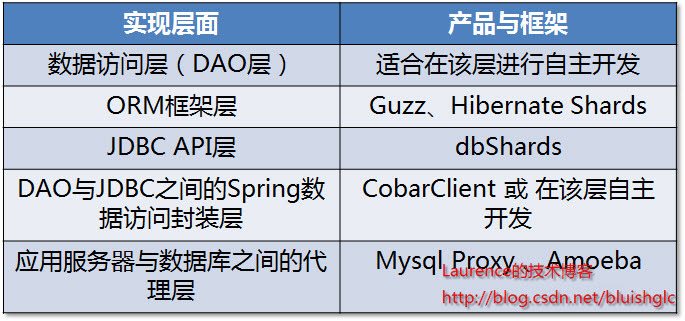

## 概念

数据库sharding，是指通过某种条件，把同一个数据库中的数据分散到多个数据库或多台机器上，以减小单台机器压力。

关于sharding更多的知识请参考: [ 数据库分库分表(sharding)系列](http://blog.csdn.net/column/details/sharding.html)

## 分类和维度

### 分类

#### 垂直sharding

以表为单位，把不同的表分散到不同的数据库或主机上。按领域模型，将业务紧密，表间关联密切的表划分在一起。特点是规则简单，实施方便，适合业务之间耦合度低的系统。

#### 水平sharding

以行为单位，将同一个表中的数据按照某种条件(譬如按ID散列)拆分到不同的数据库或主机上。特点是相对复杂，适合单表巨大的系统。

### 维度

此处以电商为例

- 垂直维度: 按业务领域可以划分为booking，订单，商户，支付，物流等几个领域，可按此进行垂直拆分
- 水平维度: 电商中的两个最重要相关业务方为买家和卖家，最重要的业务为订单，所以可以依据买家和卖家信息生成订单，同时基于买家/卖家维度对相关表进行水平拆分

## sharding实现层面

从一个系统的程序架构层面来看，sharding逻辑可以在DAO层、JDBC API层、介于DAO与JDBC之间的Spring数据访问封装层(各种spring的template)以及介于应用服务器与数据库之间的sharding代理服务器四个层面上实现。

## 迁移

随着业务的发展，一般都会有一个从非sharding向sharding迁移的过程，为了保证迁移过程中数据的准确性和迁移失败的可回退，迁移过程一般分为三个阶段:

- 双写读非sharding(此时需要校验非sharding和sharding库的数据一致性)
- 双写读sharding(此时还写非sharding是为了保证出问题时可以随时回退)
- 写sharding读sharding(切换完成)

> 系统由A状态过渡到B状态（系统的迁移）是另一个比较大也比较考验水平的话题

## 需要注意的地方

### 全局主键

一旦数据库被切分到多个物理结点上，我们将不能再依赖数据库自身的主键生成机制。此时可能需要一个全局主键生成机制，可以参考[分布式系统中的全局唯一ID](https://fanteathy.github.io/2017/01/20/global_id/)

### 引入分布式事务的问题

一旦数据被切分到多个server中，势必会引入跨库事务的问题。此时可以考虑将一个跨多个数据库的分布式事务分拆成多个仅处于单个数据库上面的小事务，并通过应用程序来总控各个小事务。或者考虑一下[分布式事务的解决方案](https://fanteathy.github.io/2016/10/25/distributed-transaction-in-soa/)

### 跨节点join的问题

对应的解决方案为:

- 不使用复杂sql，这是比较推荐的作法，互联网行业一般只推荐使用简单sql
- 通过应用程序来进行处理，先在驱动表所在的DB中取出相应的驱动结果集，然后根据驱动结果集再到被驱动表所在的DB中取出相应的数据。

### 跨节点合并排序分页问题

对应的解决方案为:

- 在应用程序中完成对应的合并排序分页。要记住一个基本原则: ***尽量避免使用数据库做运算***，因为数据库是不方便扩展的，因此只建议让数据库做基本的存储和事务保证功能。而应用服务器理论上是可以无限scale out的，所以资源消耗型的计算都建议由DB数据器移到应用服务器
- 使用`搜索引擎`解决。搜索引擎和CACHE实际都是DB功能的扩展，使用搜索引擎是很好地提高DB性能和弥补DB缺陷的手段

### 数据热点问题

电商网站按买家ID分片的时候各分片间数据基本分布均匀，但是按卖家ID分片的时候由于可能存在热点卖家的问题，此时可能出现数据在某些分片集中，可以对热点分片考虑再分片。

### 迁移过程非sharding和sharding数据不一致

由于各种原因，可能存在此问题。这是在迁移过程中需要解决的问题，只有两者数据一致时迁移第一阶段才算完成

### 多维度sharding数据不一致

电商行业普通采用买家和卖家两维度的分片，此时由于两维度数据的提交不在同一个事务中，所以可能存在分布式事务的问题。为了保证两维度数据一致，可以考虑对另一维度的数据进行补偿（不考虑比较复杂的两阶段提交）