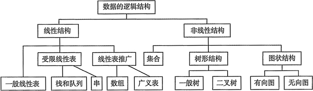

## 逻辑结构

逻辑结构是指数据元素之间的逻辑关系，即从逻辑关系上描述数据。它与数据的存储无关，是独立于计算机的。数据的逻辑结构分为线性结构和非线性结构，线性表是典型的线性结构；集合、树和图是典型的非线性结构。

数据的逻辑结构分类见图。

- 集合结构中的数据元素之间除了 “同属于一个集合”的关系外，别无其他关系。
- 线性结构结构中的数据元素之间只存在一对一的关系。
- 树形结构结构中的数据元素之间存在一对多的关系。
- 图状结构或网状结构结构中的数据元素之间存在多对多的关系。

## 存储结构

存储结构是指数据结构在计算机中的表示（又称映像），也称物理结构。它包括数据元素的表示和关系的表示。数据的存储结构是逻辑结构用计算机语言的实现，它依赖于计算机语言。

数据的存储结构主要有：顺序存储、链式存储、索引存储和散列存储。

- 顺序存储：把逻辑上相邻的元素存储在物理位置上也相邻的存储单元里，元素之间的关系由存储单元的邻接关系来体现。其优点是可以实现随机存取，每个元素占用最少的存储空间；缺点是只能使用相邻的一整块存储单元，因此可能产生较多的外部碎片。

- 链式存储：不要求逻辑上相邻的元素在物理位置上也相邻，借助指示元素存储地址的指针表示元素之间的逻辑关系。其优点是不会出现碎片现象，充分利用所有存储单元；缺点是每个元素因存储指针而占用额外的存储空间，并且只能实现顺序存取。

- 索引存储：在存储元素信息的同时，还建立附加的索引表。索引表中的每一项称为索引项，索引项的一般形式是：（关键字，地址）。其优点是检索速度快；缺点是增加了附加的索引表，会占用较多的存储空间。另外，在增加和删除数据时要修改索引表，因而会花费较多的时间。

- 散列存储：根据元素的关键字直接计算出该元素的存储地址，又称为Hash存储。其优点是检索、增加和删除结点的操作都很快；缺点是如果散列函数不好可能出现元素存储单元的冲突，而解决冲突会增加时间和空间开销。