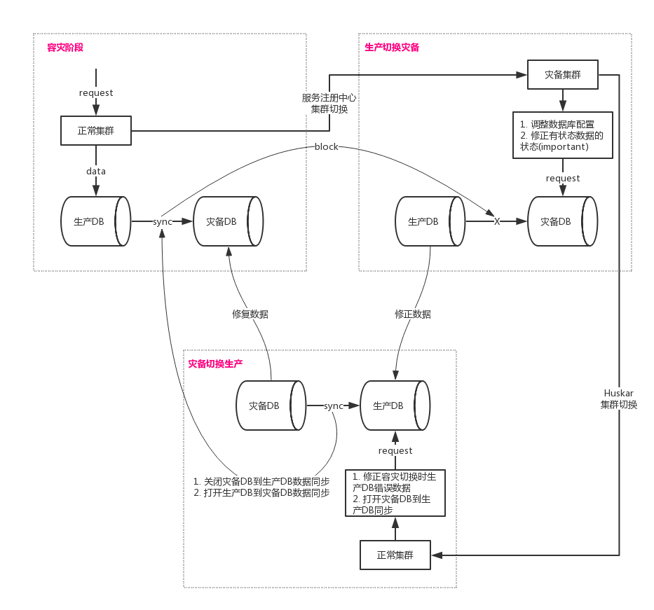

## 形式

为了保证业务的高可用，需要保证关键业务做好灾备。

网站灾备方案不但承担容灾的任务，很多时候也承担着负载均衡，优化性能的任务。网站灾备有以下几种方式。

### 主备镜像(冷备)

两个数据中心服务器部署完全一样，每次网站发布都要在两个数据中心同时发布，保证运行系统版本一致。两个数据中心有主备之分，数据通过准实时的同步系统从主站不断同步到备站。主站发生灾害性故障导致完全不可用，则将域名解析切换到备站。这种方案纯粹是为了容灾。

### 业务互补，数据同步

如某网站美国机房和国内机房部署的服务在业务上互补，美国机房部署买家服务，国内机房部署卖家服务，海外用户（主要是买家）访问美国机房，国内用户（主要是卖家）访问国内机房。主要业务数据互相实时同步，因为数据在两个机房同时写入，可能会发生冲突。

### 主主镜像(多活)

部署和发布模式与主备一样，但是多个数据中心是同时启用的，根据用户地域将域名解析到不同的机房，数据实时同步。如新浪微博。

如北方用户访问北京机房，南方用户访问上海机房。主要业务数据互相实时同步。

### 一写多读(类似于DB`单master多slave`)

数据写入只发生在一个数据中心，但是为了加快地区用户访问，会将数据同步到其他数据中心供只读访问。这种方案适用于读多写少的网站。比如wikipedia。

--------------------
本文讨论`主备镜像`形式的灾备。

## 流程(主备镜像)

灾备对应的流程如下:

## 关键点

### 数据灾备

灾备的重点在于数据，即灾难发生后可以确保用户原有的数据不会丢失或者遭到破坏。解决方案是依赖基于网络的数据复制工具，实现生产中心和灾备中心之间的异步/同步的数据传输

数据灾备包括DB, rmq, cache的灾备

- DB的灾备依赖DB的主从复制实现
- 由于架构设计时rmq不建议使用在关键链路，并且应该提供对应的业务补偿，所以不考虑同步rmq的数据
- 关键链路中cache只允许使用作缓存，所以不需要考虑同步数据

### 应用灾备

`应用灾备`是把应用处理能力再复制一份，也就是在异地灾备中心再构建一套支撑系统。`应用灾备`能提供应用接管能力，即在生产中心发生故障的情况下，能够在灾备中心接管应用，从而尽量减少系统停机时间，提高业务连续性。

## 注意点

- 由于应用灾备可能并未覆盖全路径，所以灾备环境调用未部署服务时需要做容错/降级处理
- 数据同步的技术多种多样，即可以基于存储阵列的复制软件实现，比如EMC MirrorView、H3C Replication等，也可以基于服务器或者应用软件实现，比如Veritas VVR、Oracle DataGuard等。但不管采用何种技术，都只是在不同的层面实现了数据的同步，要具备应用接管，还需要其他组件的配合，比如DNS域名切换解析、备用网络启用、应用服务切换等等。
- cache未做数据同步时，在生产流量切换到灾备时，为了防止灾备所有流量打到DB，可能需要在流量切换前做cache预热
- 数据表冲突的防止。在做DB切换时，需要防止主键冲突，因此auto_increment的字段需要调整自增因子等
- 应用服务集群切换可以在服务注册中心处理
- 切换至冷备机器时，对于有状态的数据，需要在切换前修复数据状态；对于需要事件驱动状态向前的数据，需要复现事件或者手动推动状态向前。总而言之，要保证切换到灾备后，***状态机(业务流程)在任何点中断时，系统能够推进状态机走到终态(important)***
- 需要考虑跨机房数据延时问题（以及由此造成的一系列数据问题），需要容忍数据丢失，并为数据延时考虑相应的对策

