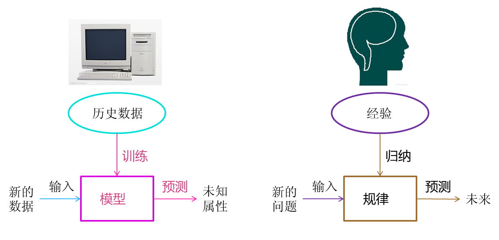

## Overview

### 定义

机器学习研究的是`计算机怎样模拟人类的学习行为，以获取新的知识或技能，并重新组织已有的知识结构使之不断改善自身`。通过机器学习算法，`计算机从数据中自动分析获得规律(模型)，并利用规律(模型)对未知数据进行预测`。



### 运用

#### 分类问题

根据数据样本上抽取出的特征，判定其属于有限个类别中的哪一个，如

- 垃圾邮件识别
- 车牌识别

#### 回归问题

根据数据样本上抽取出的特征，预测一个连续值的结果

- 餐厅出餐时间预测

#### 聚类问题

根据数据样本上抽取出的特征，让相近/相关的样本聚集在一起。比如： 

- 用户群体划分
- 用户画像

## Learning Style

### Supervised Learning


这类问题中，给定的训练样本中，每个样本的输入x都对应一个确定的结果y，我们需要训练出一个模型(数学上看是一个x→y的映射关系f)，在未知的样本x′给定后，我们能对结果y′做出预测。

这里的预测结果如果是离散值(很多时候是类别类型，比如邮件分类问题中的垃圾邮件/普通邮件，比如用户会/不会购买某商品)，那么我们把它叫做`分类问题`(classification problem)；如果预测结果是连续值(比如房价，股票价格等等)，那么我们把它叫做`回归问题`(regression problem)。

有一系列的机器学习算法是用以解决监督学习问题的，比如最经典的用于分类问题的朴素贝叶斯、逻辑回归、支持向量机等等；比如说用于回归问题的线性回归等等。

### Unsupervised Learning


有另外一类问题，给我们的样本并没有给出『标签/标准答案』，就是一系列的样本。而我们需要做的事情是，在一些样本中抽取出通用的规则。这叫做『无监督学习』。包括`关联规则`和`聚类算法`在内的一系列机器学习算法都属于这个范畴。

### Semi-Supervised Learning


这类问题给出的训练数据，有一部分有标签，有一部分没有标签。我们想学习出数据组织结构的同时，也能做相应的预测。此类问题相对应的机器学习算法有自训练(Self-Training)、直推学习(Transductive Learning)、生成式模型(Generative Model)等。

### Reinforcement Learning


在这种学习模式下，输入数据作为对模型的反馈，不像监督模型那样，输入数据仅仅是作为一个检查模型对错的方式，在强化学习下，输入数据直接反馈到模型，模型必须对此立刻作出调整。常见的应用场景包括动态系统以及机器人控制等。常见算法包括Q-Learning以及时间差学习（Temporal difference learning）。 

## Algorithms(Grouped By Similarity)

### 回归算法(Regression Algorithms)


回归算法是一种通过最小化预测值与实际结果值之间的差距，而得到输入特征之间的最佳组合方式的一类算法。对于连续值预测有线性回归等，而对于离散值/类别预测，我们也可以把逻辑回归等也视作回归算法的一种，常见的回归算法如下：

- Linear Regression(回归问题)
- Logistic Regression(分类问题)

### 基于实例的算法(Instance-based Algorithms)


最后建成的模型，对原始数据样本实例依旧有很强的依赖性。这类算法在做预测决策时，一般都是使用某类相似度准则，去比对待预测的样本和原始样本的相近度，再给出相应的预测结果。常见的基于实例的算法有：

- k-Nearest Neighbour (kNN)(分类问题)

### 决策树类算法(Decision Tree Algorithms)


决策树类算法，会基于原始数据特征，构建一颗包含很多决策路径的树。预测阶段选择路径进行决策。常见的决策树算法包括：

- Conditional Decision Trees(分类问题)

### 贝叶斯类算法(Bayesian Algorithms)


指的是在分类和回归问题中，隐含使用了贝叶斯原理的算法。包括：

- Naive Bayes(分类问题)

### 聚类算法(Clustering Algorithms)


把输入样本聚成围绕一些中心的『数据团』，以发现数据分布结构的一些规律。常用的聚类算法包括：

- k-Means(聚类问题)

### 关联规则算法(Association Rule Learning Algorithms)


关联规则算法是这样一类算法：它试图抽取出，最能解释观察到的训练样本之间关联关系的规则，也就是获取一个事件和其他事件之间依赖或关联的知识，常见的关联规则算法有：

- Apriori algorithm
- Eclat algorithm

## Workflow

### 业务需求抽象成数学问题

明确我们可以获得什么样的数据，目标是一个分类还是回归或者是聚类的问题。需要在理解业务的问题上选择合适的算法模型

### 获取数据

数据的来源；数据要有代表性，否则必然会过拟合；数据的量级以及降维等

### 特征预处理与特征选择

特征预处理、数据清洗是很关键的步骤，往往能够使得算法的效果和性能得到显著提高。常用的方法有`归一化`、`离散化`、`因子化`、`缺失值处理`、`去除共线性`等。

筛选出显著特征、摒弃非显著特征，需要机器学习工程师反复理解业务。这对很多结果有决定性的影响。这需要运用特征有效性分析的相关技术，如`相关系数`、`卡方检验`、`平均互信息`、`条件熵`、`后验概率`、`逻辑回归权重`等方法。

### 训练模型与调优

在训练的过程中调整算法的参数，使得结果变得更加优良。

### 模型诊断

- `过拟合`、`欠拟合`判断是模型诊断中至关重要的一步。常见的方法如`交叉验证`，`绘制学习曲线`等。过拟合的基本调优思路是增加数据量，降低模型复杂度。欠拟合的基本调优思路是提高特征数量和质量，增加模型复杂度。
- 误差分析 也是机器学习至关重要的步骤。通过观察误差样本，全面分析误差产生误差的原因：是参数的问题还是算法选择的问题，是特征的问题还是数据本身的问题。
- 诊断后的模型需要进行调优，调优后的新模型需要重新进行诊断，这是一个反复迭代不断逼近的过程，需要不断地尝试， 进而达到最优状态。

> 欠拟合


欠拟合的原因：模型复杂度过低，不能很好的拟合所有的数据，训练误差大；

避免欠拟合：增加模型复杂度，如采用高阶模型（预测）或者引入更多特征（分类）等。

> 过拟合


过拟合的原因：模型复杂度过高，训练数据过少，训练误差小，测试误差大；

避免过拟合：降低模型复杂度，如加上正则惩罚项，如L1，L2，增加训练数据等。


> 合适的拟合


### 模型融合

单个模型的结果不够理想，如果想得到更好的结果，需要把很多单个模型的结果融合在一起。可以想像成“再次的机器学习过程”。

### 上线运行

模型在线上运行的效果直接决定模型的成败。 不单纯包括其准确程度、误差等情况，还包括其运行的速度(时间复杂度)、资源消耗程度（空间复杂度）、稳定性是否可接受。

## Machine learning in python

### numpy

数组运算

### scikit-learn

scikit-learn作为一个丰富的Python机器学习库，实现了绝大多数机器学习的算法。这是针对实际应用场景的各种条件限制，对scikit-learn里完成的算法构建的一颗决策树，每一组条件都是对应一条路径，能找到相对较为合适的一些解决方法


根据问题是有/无监督学习和连续值/离散值预测，分成了`分类`、`聚类`、`回归`和`降维`四个方法类，每个类里根据具体情况的不同，又有不同的处理方法。

### matplotlib

非常方便的数据可视化工具

## Demo

一元线性回归预测披萨价格

已知的训练样本如下:

训练样本|直径（英寸）|价格（美元）
----|----|----
1|6|7
2|8	|9
3|10|13
4|14|17.5
5|18|18

披萨价格与直径的图示如下

```
import matplotlib.pyplot as plt
def runplt():
    plt.figure()
    plt.axis([0, 25, 0, 25])
    plt.grid(True)
    return plt
    
plt = runplt()
X = [[6], [8], [10], [14], [18]]
y = [[7], [9], [13], [17.5], [18]]
plt.plot(X, y, 'k.')
plt.show()
```

能够看出，匹萨价格与其直径正相关。使用scikit-learn构造一元线性回归模型

```
from sklearn.linear_model import LinearRegression
# 创建并拟合模型
model = LinearRegression()		
model.fit(X, y)					
# 预测其他直径披萨的价格
X2 = [[0], [10], [14], [25]]
y2 = model.predict(X2)
plt.plot(X2, y2, 'g-')
plt.show()
```

可以看出拟合出的披萨价格和直径的模型。
