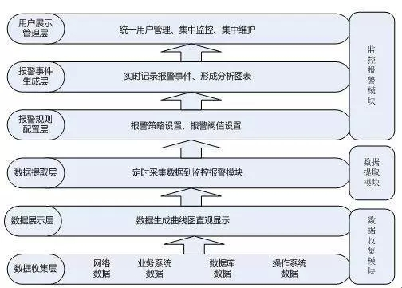

## 背景

对于应用开发团队来说，每天面对大量复杂多变业务逻辑的开发。为了发现潜在的问题，为了发生突发问题进行排障时有据可循，更为了了解服务的运行状况和服务性能，一个完善的自动化的监控报警系统非常必要。

## 系统架构

### 监控系统

一般监控系统的系统架构包括以下方面

#### 指标收集agent

指标的数据源主要有以下几个:

- 代码埋点
- 日志
- 数据库

一般增加一个collect agent用于统一数据格式，收集实时指标，同时用于数据的广播，解耦系统以及快速持久化等，同时将所有的指标发送到这个agent

#### 传输

由于指标是非业务数据，属于样本性质，可以容忍丢失。所以数据源到agent的数据传输，一般使用UDP协议

#### 分析计算

需要进行分析计算的`指标维度`一般有以下几种:

- Gauges: 代表一个度量的即时值。当你的程序运行的时候，内存使用量和CPU占用率都可以通过Gauge值来度量。 
- Counters: 就是计数器，是一个可以用来增加或者减少值的数。例如，可以用它来计数队列中加入的Job的总数。
- Meters: 用来计算事件的速率。例如 request per second。还可以提供1分钟，5分钟，15分钟不断更新的平均速率
- Histograms: 可以为数据流提供统计数据。除了最大值，最小值，平均值外，它还可以测量中值(median)，百分比比如XX%这样的Quantile数据
- Timers: 用来测量一段代码被调用的速率和用时

#### 显示 & 通知

对应的数据在进行计算后，需要进行显示。同时若有异常情况，需要通知关注的人员。

### 报警系统

报警系统的数据来源和监控系统相似，只是在`分析计算`后添加了`报警规则配置`和`报警事件生成`层

-----
监控报警系统的系统架构可以参考: [统一监控报警平台的架构设计思路分享](http://os.51cto.com/art/201603/507858.htm)

## 技术方案

- 数据的采集可以使用`Statsd`,`Collectd`
- 数据的存储可以使用`Graphite`
	- `carbon`守护进程，接收`Statsd`发送过来的原始统计数据
	- `whisper`用来存储统计数据的库
	- `graphite webapp`用来图形化展示统计数据的web项目
- 数据的存储也可以使用`influxdb` 
- 使用`Grafana`对指标进行展示  
- 报警使用`kapacitor`

可以对技术方案进行以下组合:

- `TICK(telegraf + influxdb + chronograf + kapacitor)`
- `statsd + graphite + grafana + banshee`(ele.me使用)

## 监控设置

完善的监控和报警可参考如下设置

### 服务 & 接口

- 关键接口调用量，失败量
- 关键接口耗时
- 关键接口异常
- 自定义的业务指标监控，如交易中的买家数，金额等

### 基础服务

- DB: 具体SQL响应时间，调用量，失败量，慢SQL数等
- REDIS: 对应操作响应时间，调用量，失败量，cache命中率等
- RMQ: 消息ready/unack/total数，publish/get速度(参看`rabbitmq management插件提供的指标`)，消息堆积数量等

### 应用服务器

- cpu load, cpu util
- memory util, memory swap
- network-in, network-out, network-speed
- disk io
- TCP connection

## 报警设置

报警主要针对以下情况

- 指标趋势
	- 如某段时间指标值快速上升或者快速下降, 同环比趋势异常等
- 指标阈值
	- 如调用量超过一定值，cache miss率超过一定值等 
- 指标特殊值
	- 如指标为0，为空等 