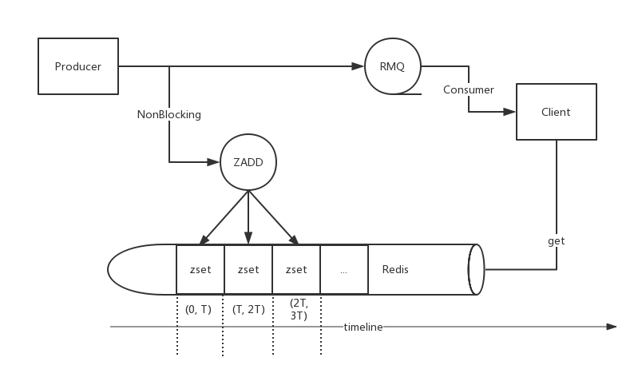

## Design For Failure

`Design For Failure`的核心思想在于: ***容忍错误，快速恢复，将failure当做普通事件处理***。

当应用构建在云服务(cloud)上，这个概念更多被提及([Design For Failure Is Key To Success In The Cloud](http://www.slideshare.net/ashayc/design-for-failure-is-key-to-success-in-the-cloud))。因为相比普通线上环境，云设施的复杂度更大，同时也导致了稳定性以及健壮性的复杂，因此`Failure`在云环境需要被当做普通事件处理。最佳实践可参考[The Netflix Simian Army](http://techblog.netflix.com/2011/07/netflix-simian-army.html)

同时对于正常环境，`Design For Failure`的设计思想在保证服务的健壮性，可用性上也大有裨益。

饿了么订单系统在`Design For Failure`思想上的实践主要有以下四个内容。第一是`消息广播补偿`，第二是`主流程补偿`，第三是`灾备`，第四是`随机故障测试系统`。

---------------

本文详细介绍一下`消息广播补偿`

<!-- more -->

## 补偿方案

补偿方案可以考虑:

- 不同介质的补偿，如mq/redis互相补偿
- 不同交互方式的补偿，如push/pull结合的补偿
- 失败操作的Retry补偿
- 记录操作状态，轮询失败状态补偿

为了保证消息的高可用，将发送的消息同时存储到另外一种介质。出于性能和吞吐量上的考虑，此处考虑选择使用redis。rabbitmq发送消息时，同时保存对应routing_key的订单号到redis对应的zset中，并提供接口在rabbitmq异常时查询一定时间段内对应routing_key的订单号



## 存储方案

由于发送的消息均有一个routing_key(订单状态转变时发送对应routing_key的订单)，所以在存储时应该将消息以routing_key分类存放。考虑将order_id存储在以routing_key为key的zset中，同时以创建时间的时间戳作为zset的score，方便获取指定时间内的订单号

```
zadd(routing_key, int(time.time()), order_id)
```

## 容量计算

由于每个订单的生命周期发出的消息平均约为5条，如订单的峰值TPS为1000，订单号为18位，需要提供查询半个小时之内的消息，根据解决方案可知需要至少存储1小时的内容，则需要的内存为

```
3600 * 1000 * 18 * 5 / 1024 / 1024 = 309M
```

## 查询接口

同时需要提供查询接口查询一段时间内对应routing_key的订单号，对应接口定义如下:

```
map<string, list<i64>> get_mq_order_ids(1: list<string> routing_keys,
                                        2: Timestamp from_datetime,
                                        3: Timestamp to_datetime)

```


