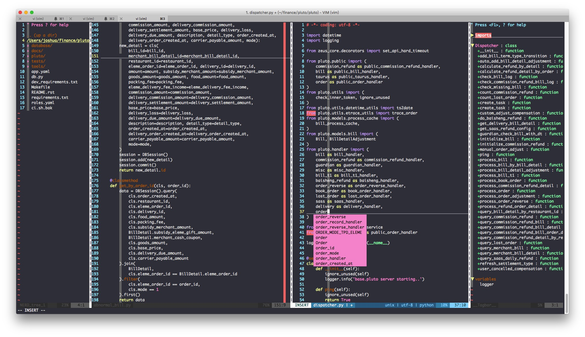

## 关于vim

常言道: 工欲善其事，必先利其器。作为一个程序员，一个常用的工具就是`编辑器`。相比IDE，vim具有以下几种特性:

- 跨平台及统一环境
	- 无论是在windows还是在*nix，vim是一个很完美的跨平台文本编辑器。
- 定制化及可扩展
	- vim提供一个vimrc的配置文件来配置vim，并且自己可以定制一些插件来实现各种功能 
- 高效命令行
	- 使用vim编辑文本，只需在键盘上操作就可以，根本无需用到鼠标。

笔者最终配置的vim如下图所示:



对应的repo为: [https://github.com/joshua-hw/my_vim](https://github.com/joshua-hw/my_vim)

## 配置

如果你需要配置vim，只需在Home目录创建一个`~/.vimrc`文件即可以配置vim了。以下是笔者的`.vimrc`文件内容。

```

"自己定义vimrc常见设置和一些键位的设置

"---------------- 加载插件管理文件 --------------------
if filereadable(expand("~/.vimrc.bundles"))
    source ~/.vimrc.bundles
endif

" 在插入模式下MAC下的delete不能删除问题
set backspace=2
set colorcolumn=80

"--------------- leader设定 -------------
let mapleader = ','
let g:mapleader = ','

"------------------------------- 基本设置 -----------------------------------

"开启语法高亮
"syntax enable 该命令只在当前文件有效
syntax on " 所有缓冲区文件都有效

"-------------- 文件检测 ----------------------
filetype on
filetype indent on
filetype plugin on
filetype plugin indent on

colorscheme blackbeauty         " 配色主题

set autoread                 " 文件修改之后自动载入。
set shortmess=atI            " 启动的时候不显示那个援助索马里儿童的提示

set laststatus=2
"set confirm                  " 取消光标闪烁
set noswapfile               " 关闭交换文件

set wildignore=*.swp,*.bak,*.pyc,*.class,.svn

set cursorcolumn             " 突出显示当前列
set cursorline               " 突出显示当前行

set title 
set novisualbell
set noerrorbells

set magic

set ruler                    " 显示当前行号和列号
set number                   " 显示行号
set nowrap                   " 取消换行

set showcmd                  " 在状态栏显示正在输入的命令
set showmode                 " 显示vim模式

set showmatch                " 括号匹配，高亮
set matchtime=1         

set hlsearch                 " 高亮搜索的文本
set incsearch                " 即时搜索
set ignorecase               " 搜索忽略大小写
set smartcase                " 有一个或以上大写字母时仍大小敏感

set foldenable               " 代码折叠
set foldmethod=indent
set foldlevel=99             

" autosave
"let g:auto_save = 1  " enable AutoSave on Vim startup
"let g:auto_save_no_updatetime = 1  " do not change the 'updatetime' option
"let g:auto_save_in_insert_mode = 0  " do not save while in insert mode
"let g:auto_save_silent = 1  " do not display the auto-save notification
"let g:auto_save_events = ["InsertLeave", "TextChanged"]
"let g:auto_save_keep_marks = 0

" 代码折叠自定义快捷键
let g:FoldMethod = 0
map <leader>zz :call ToggleFold()<cr>
fun! ToggleFold()
    if g:FoldMethod == 0
        exe "normal! zM"
        let g:FoldMethod = 1
    else
        exe "normal! zR"
        let g:FoldMethod = 0
    endif
endfun

set smartindent              " 智能缩进
set autoindent               " 自动缩进

"------------------------------- tab 相关设置 ---------------------
set tabstop=4                " 设置tab的宽度
set shiftwidth=4             " 每一次缩进对应的空格数
set softtabstop=4            " 按退格键是可以一次删除4个空格
set smarttab                 
set expandtab                " 将tab自动转化为空格
set shiftround               " 缩进时，取整

"------------------------------- 文件编码 -------------------------
set encoding=utf-8
set fileencodings=utf-8,ucs-bom,shift-jis,gb18030,gbkgb2312,cp936 " 自动判断编码
set helplang=cn
set ffs=unix,mac,dos

set formatoptions+=B          " 合并两行中文时，不在中间加空格
set termencoding=utf-8        " 终端编码

"------------------------------- 其他设置 -------------------------
set completeopt=longest,menu  " 让vim的补全菜单和ide一致
set wildmenu
set wildignore=*.0,*~,*.pyc,*.class

autocmd! bufwritepost .vimrc source % " vimrc 文件修改后自动加载

"------------------------------- 自定义快捷键设置 -----------------

" 关闭方向键，使用hjkl
map <Left> <Nop>             
map <Right> <Nop>
map <Up> <Nop>
map <Down> <Nop> 

" 行首 和 行尾 map
noremap H ^
noremap L $

" 切换到命令模式map 
noremap ; :

" 插入模式下 kj 映射到 Esc
inoremap kj <Esc>       

nnoremap <leader>q :q!<CR>
nnoremap <leader>w :wq<CR>

" 分屏切换
noremap w<up> <c-w><up>
noremap wk <c-w><up>
noremap w<left> <c-w><left>
noremap wh <c-w><left>
noremap w<right> <c-w><right>
noremap wl <c-w><right>
noremap w<down> <c-w><down>
noremap wj <c-w><down>

" python 文件的一般设置
autocmd FileType python set tabstop=4 shiftwidth=4 expandtab ai

" php自动完成
autocmd FileType php set omnifunc=phpcomplete#CompletePHP
" 当文件类型为php时，将系统自动补全的快捷键更改为 ,a
autocmd FileType php inoremap <leader>a <C-x><C-o>

" 只有在是PHP文件时，才启用PHP补全
au FileType php call AddPHPFuncList()
function! AddPHPFuncList()
    set dictionary-=~/.vim/funclist.txt dictionary+=~/.vim/funclist.txt
    set complete-=k complete+=k
endfunction

" phpqa
let g:phpqa_php_cmd='php'
let g:phpqa_codesniffer_args = "--standard=PSR2" " Set the codesniffer args
let g:phpqa_codesniffer_cmd='phpcs' " PHP Code Sniffer binary (default = \"phpcs\")
let g:phpqa_messdetector_cmd='phpmd' " PHP Mess Detector binary (default = \"phpmd\")
let g:phpqa_messdetector_autorun = 0 " Don't run messdetector on save (default = 1)
let g:phpqa_codesniffer_autorun = 0 " Don't run codesniffer on save (default = 1)
let g:phpqa_codecoverage_autorun = 1 " Show code coverage on load (default = 0)
" Clover code coverage XML file
" let g:phpqa_codecoverage_file = \"/path/to/clover.xml\"
" " Show markers for lines that ARE covered by tests (default = 1)
let g:phpqa_codecoverage_showcovered = 0
 
" Stop the location list opening automatically
let g:phpqa_open_loc = 0


" 定义函数AutoSetFileHead，自动插入文件头
autocmd BufNewFile *.sh,*.py exec ":call AutoSetFileHead()"
function! AutoSetFileHead()
"如果文件类型为.sh文件
if &filetype == 'sh'
    call setline(1, "\#!/bin/bash")
endif

"如果文件类型为python
if &filetype == 'python'
    call setline(1, "\#!/usr/bin/env python")
    call append(1, "\# -*- coding: utf-8 -*- ")
endif
    normal G
    normal o
    normal o
endfunc

"set some keyword to highlight
if has("autocmd")
    "Highlight TODO, FIXME, NOTE, etc.
    if v:version > 701
        autocmd Syntax * call matchadd('Todo', '\W\zs\(TODO\|FIXME\|CHANGED\|DONE\|XXX\|BUG\|HACK\)')
        autocmd Syntax * call matchadd('Debug', '\W\zs\(NOTE\|INFO\|IDEA\|NOTICE\)')
    endif
endif

" ----------------------- 插件设置 ------------------------------

" *********************** NERDTree 插件设置 *********************
" vim启动时触发
" autocmd vimenter * NERDTree
map <leader>n :NERDTreeToggle<CR>
autocmd bufenter * if (winnr("$") == 1 && exists("b:NERDTreeType") && b:NERDTreeType == "primary") | q | endif
let NERDTreeShowLineNumbers=1
let NERDTreeIgnore=['\.pyc$', '\~$']
" 分屏打开文件
let g:NERDTreeMapOpenVSplit = 'v' 
let g:NERDTreeMapOpenSplit = 's'   

" *********************** tagbar 插件设置 ***********************
map <leader>g :TagbarToggle<CR>
let g:tagbar_auto_focus=1

" *********************** taglist 插件设置 **********************
let Tlist_Ctags_Cmd="/usr/local/bin/ctags"
let Tlist_Show_One_File=1
let Tlist_Exit_OnlyWindow=1
let Tlist_Auto_Open=0
let Tlist_Auto_Highlight_Tag=1
let Tlist_Use_Right_Window=1
let Tlist_WinWidth=35

" *********************** 快速跳转 ******************************
let g:EasyMotion_smartcase=1
map <leader><leader>h <Plug>(easymotion-linebackward)
map <leader><leader>j <Plug>(easymotion-j)
map <leader><leader>k <Plug>(easymotion-k)
map <leader><leader>l <Plug>(easymotion-lineforward)
map <leader><leader>. <Plug>(easymotion-repeat)

" *********************** 语法检查 ******************************
let g:syntastic_error_symbol='>>'
let g:syntastic_warning_symbol='>'
let g:syntastic_check_on_open=1
let g:syntastic_check_on_wq=0
let g:syntastic_enable_highlighting=1
let g:syntastic_python_checkers=['pyflakes', 'pep8']
let g:syntastic_python_pep8_args='--ignore=E501,E225'

let g:syntastic_always_populate_loc_list=0
let g:syntastic_auto_loc_list=0
let g:syntastic_loc_list_height=3

function! ToggleErrors()
    let old_last_winnr = winnr('$')
    lclose
    if old_last_winnr == winnr('$')
        "Nothing was closed, open syntastic error location panel
        Errors
    endif
endfunction

nnoremap <leader>s :call ToggleErrors()<cr>

" *********************** autopep8语法检查 ******************************
let g:autopep8_max_line_length=79


" *********************** 自动补全引号等插件设置 ****************
au FileType python let b:delimitMate_nesting_quotes = ['"']

" ********************** 全局搜索 ***********************
let g:ag_prg = "ag --nogroup --nocolor --column"


" python 相关语法检查
let g:pyflakes_use_quickfix = 0
let python_highlight_all = 1

" *********************** markdown 插件设置 *********************
let g:vim_markdown_folding_disable = 1

" 多光标选中编辑设置
" let g:multi_cursor_use_default_mapping = 0
" let g:multi_cursor_next_key='<C-m>'
" let g:multi_cursor_prev_key='<C-p>'
" let g:multi_cursor_skip_key='<C-x>'
" let g:multi_cursor_quit_key='<Esc>'

" *********************** 快速注释 ******************************
let g:NERDSpaceDelims = 1

" *********************** 文件搜索插件 **************************
let g:ctrlp_map = '<leader>p'
let g:ctrlp_cmd = 'CtrlP'
map <leader>f : CtrlPMRU<CR>
let g:ctrlp_custom_ignore = {
    \ 'dir': '\v[\/]\.(git|hg|svn|rvm)$',
    \ 'file': '\v\.(exe|so|dll|zip|tar|tar.gz|pyc)$',
    \}

let g:ctrlp_working_path_mode=0
let g:ctrlp_match_window_bottom=1
let g:ctrlp_max_height=15
let g:ctrlp_match_window_reversed=0
let g:ctrlp_mruf_max=500
let g:ctrlp_follow_symlinks=1

" ctrlp相关插件 函数搜索
nnoremap <Leader>fu: CtrlPFunky<Cr>
nnoremap <Leader>fU:execute 'CtrlpFunky ' . expand('<cword>')<Cr>
let g:ctrlp_funky_syntax_highlight = 1
let g:ctrlp_extensions = ['funky']

" *********************** pyflakes_vim 插件设置 *****************
let g:pyflakes_user_quickfix=0

" *********************** python-syntax *************************
let python_highlight_all=1

" *********************** vim-markdown **************************
let g:vim_mardown_folding_disabled=1

" *********************** 自动补全插件 **************************
let g:ycm_key_list_select_completion=['<Down>']
let g:ycm_key_lsit_previous_completion=['<Up>']
let g:ycm_complete_in_comments = 1  "在注释输入中也能补全
let g:ycm_complete_in_strings = 1   "在字符串输入中也能补全
let g:ycm_use_ultisnips_completer = 1 "提示UltiSnips
let g:ycm_collect_identifiers_from_comments_and_strings = 1   "注释和字符串中的文字也会被收入补全
let g:ycm_collect_identifiers_from_tags_files = 1

" ********************** 对齐线设置 ****************************
let g:indent_guides_enable_on_vim_startup = 0
let g:indent_guides_auto_colors = 0
let g:indent_guides_guide_size = 1 
set ts=4 sw=4 et
let g:indent_guides_start_level = 2
autocmd VimEnter,Colorscheme * :hi IndentGuidesOdd  guibg=red   ctermbg=3
autocmd VimEnter,Colorscheme * :hi IndentGuidesEven guibg=green ctermbg=4
hi IndentGuidesOdd guibg=red ctermbg=3

hi IndentGuidesEven guibg=green ctermbg=4

" 跳转到定义处, 分屏打开
let g:ycm_goto_buffer_command = 'vertical-split'
nnoremap <leader>jd :YcmCompleter GoToDefinitionElseDeclaration<CR>
nnoremap <leader>gd :YcmCompleter GoToDeclaration<CR>
" 引入，可以补全系统，以及python的第三方包 针对新老版本YCM做了兼容
" old version
if !empty(glob("~/.vim/bundle/YouCompleteMe/cpp/ycm/.ycm_extra_conf.py"))
    let g:ycm_global_ycm_extra_conf ="~/.vim/bundle/YouCompleteMe/cpp/ycm/.ycm_extra_conf.py"
endif
" new version
if !empty(glob("~/.vim/bundle/YouCompleteMe/third_party/ycmd/cpp/ycm/.ycm_extra_conf.py"))
    let g:ycm_global_ycm_extra_conf = "~/.vim/bundle/YouCompleteMe/third_party/ycmd/cpp/ycm/.ycm_extra_conf.py"
endif

" 直接触发自动补全 insert模式下
" let g:ycm_key_invoke_completion = '<C-Space>'
let g:ycm_key_list_select_completion=['<tab>', '<Down>']
" 黑名单,不启用
let g:ycm_filetype_blacklist = {
            \ 'tagbar' : 1,
            \ 'gitcommit' : 1,
            \}

" last_edit_marker.vim设置
nmap <C-y> g'Z

augroup LastEditMarker
    autocmd!
    autocmd InsertLeave * normal mZ
augroup END

" vim，主机复制共享
vmap <C-c> "+y
vmap <C-x> "+c    
vmap <C-v> c<ESC>"+p    
imap <C-v> <C-r><C-o>+    
nmap <C-v> "+p

" powerline设置
set guifont=PowerlineSymbols\ for\ Powerline
set nocompatible
set laststatus=2
set t_Co=256
let g:Powerline_symbols = 'fancy'
let Powerline_symbols='compatible'    

" gitgutter设置
let g:gitgutter_map_keys = 0
let g:gitgutter_enabled = 0
let g:gitgutter_highlight_lines = 1
nnoremap <leader>gs :GitGutterToggle<CR>

```

## 插件

使用`vumdle`管理vim的插件，使用过程如下:

- 在Home目录创建`~/.vim`目录和`.vimrc`文件，可使用上面的`.vimrc`文件


- 安装vundle

```
git clone https://github.com/gmarik/vundle.git ~/.vim/bundle/vundle
```

- 添加一个`~/.vimrc.bundles`文件来保存所有插件的配置，在`~/.vimrc`文件加入以下代码片段

```
if filereadable(expand("~/.vimrc.bundles"))
source ~/.vimrc.bundles
endif
```

以下是笔者的`.vimrc.bundles`文件

```
set nocompatible
filetype off

set rtp+=~/.vim/bundle/Vundle.vim
call vundle#begin()

"------------- 插件列表 ---------------------------
"插件设置和vim基本设置单独放置

Plugin 'gmarik/Vundle.vim'
Plugin 'itchyny/lightline.vim'
Plugin 'scrooloose/nerdtree'
Plugin 'ctrlpvim/ctrlp.vim'
Plugin 'tacahiroy/ctrlp-funky'
Plugin 'majutsushi/tagbar'
Plugin 'taglist.vim'
Plugin 'basepi/vim-conque'

Plugin 'Valloric/YouCompleteMe'
Plugin 'Raimondi/delimitMate'
Plugin 'scrooloose/syntastic'
Plugin 'jiangmiao/auto-pairs'
Plugin 'tpope/vim-commentary'
Plugin 'sjl/gundo.vim'
Plugin 'Lokaltog/vim-easymotion'
Plugin 'tpope/vim-fugitive'

" python
Plugin 'kevinw/pyflakes-vim'
Plugin 'hdima/python-syntax'
Plugin 'pep8'
Plugin 'tell-k/vim-autopep8'
Plugin 'python.vim--Vasiliev'
Plugin 'hynek/vim-python-pep8-indent'

" php
Plugin 'shawncplus/phpcomplete.vim'
Plugin 'joonty/vim-phpqa'

" golang
Plugin 'fatih/vim-go'
Plugin 'dgryski/vim-godef'
Plugin 'nsf/gocode', {'rtp': 'vim/'}

" markdown
Plugin 'plasticboy/vim-markdown'

" 多光标
Plugin 'terryma/vim-multiple-cursors'

" 快速注释
Plugin 'scrooloose/nerdcommenter'

" 对齐线
Plugin 'nathanaelkane/vim-indent-guides'

" 全局搜索
Plugin 'rking/ag.vim'

" 跳转到上次修改的地方
Plugin 'vim-scripts/last_edit_marker.vim'

" powerline
Plugin 'powerline/powerline'

" gitgutter
Plugin 'airblade/vim-gitgutter'

" gitv
Plugin 'vim-scripts/gitv'

call vundle#end()
filetype plugin indent on
```

打开vim，运行`:PluginInstall`或在shell中直接运行`vim +PluginInstall +qall`即可安装插件

## 快捷键

笔者设置的vim快捷键如下:

key|作用
----|-----
,g						    			|tagbar
,n						    			|nerdtree
w[hjkl]				    			|分屏切换
gt                          		|切换tab
(文件名上面)(v/Enter)					|在(新的/当前)分屏中打开文件
,q					    				|关闭对应分屏，退出不保存
,w						    			|关闭并保存
kj						    			|insert to normal
,cc						    			|注释
,cu						    			|取消注释
:vs						    			|纵向切屏
:sp						    			|横向切屏
,s						    			|语法错误信息
;/SHIFT+;				    			|nornal切换到命令行模式
H/SHIFT+右箭头 			    		|行首
L/SHIFT+左箭头			    			|行尾	
,p                         		|打开文件搜索栏
,jd                       		|跳转到变量定义处
F8                          		|按PEP8标准格式化文件
:Ag create_order --python   		|全局搜索"create_order"
'.                          		|移动光标到上一次的修改行
`.                          		|移动光标到上一次的修改点
``										|last jump
CTRL+O									|go back
CTRL+I									|go forwards
control+y/g'Z               		|可跨文件跳转到上次修改位置(last_edit_maker提供功能)
:new/e/vs/sp/tabe filename  		|新建/当前tab/纵向/横向/新tab 打开 filename
CTRL+c & COMMAND+v          		|vim复制，主机粘贴
COMMAND+c & CTRL+v          		|主机复制，vim粘贴
,a                          		|insert模式下php文件autocomplete，由phpcomplete的<C-x><C-o> inoremap而来
,gs                         		|显示文件的git更改,类似于git diff命令的显示效果
:Gitv                       		|显示项目版本库的更改，类似于tig的效果
:Gblame                     		|在git项目中查看每行最后的更改情况
:Phpcs                      		|run code sniffer(代码规范检查, 要求太严格，推荐不用)
:Phpmd                      		|run mess detector (will ask for a rule XML file if not set，推荐不用)