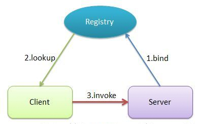

此RPC框架实现了基本的`RPC通信`及`服务注册/发现`功能。

基本原理如下:



> ***代码详见***: [rpc](https://github.com/joshua-hw/rpc)

## Techs

此RPC框架依赖于以下技术:

- `Spring`: 依赖注入
- `Netty`: NIO Server
- `Protostuff`: RPC通讯过程中的序列化/反序列化
- `Zookeeper`: 服务注册与发现

> 主要是使用`Netty`构建server，同时在服务启动时向ZK注册服务`serviceAddress`, `servicePort`等信息。使用client发送请求时，将请求动态代理成对netty server的请求。server和client的通讯使用`protostuff`进行编码和解码。

<!-- more -->

## Modules

- `rpc-client`: RPC client实现
	- `RpcClient`: RPC客户端
	- `RpcProxy`: RPC代理，用于创建RPC请求动态代理对象
- `rpc-common`
	- `bean`
		- `RpcRequest`: RPC请求结构体
		- `RpcResponse`: RPC响应结构体
	- `codec`
		- `RpcDecoder`: RPC通信解码
		- `RpcEncoder`: RPC通信编码
	- `util`
		- `CollectionUtil`: 集合工具类
		- `SerializationUtil`: 序列化/反序列化工具类
		- `StringUtil`: 字符串工具类
- `rpc-registry`: 服务注册和发现接口
	- `ServiceDiscovery`: 服务发现接口
	- `ServiceRegistry`: 服务注册接口
- `rpc-registry-zookeeper`: 基于zk的服务注册和发现
	- `ZooKeeperServiceDiscovery`: 基于zk的服务发现实现
	- `ZooKeeperServiceRegistry`: 基于zk的服务注册实现
- `rpc-sample`: RPC框架的使用代码示例
	- `rpc-sample-api`: RPC接口定义
	- `rpc-sample-demo`: RPC请求client Demo
	- `rpc-sample-service`: RPC接口实现
- `rpc-server`: RPC server实现
	- `RpcServer`: RPC服务器
	- `RpcServerHandler`: RPC请求处理
	- `RpcService`: RPC服务注解

## Usage

以下为使用步骤，代码实现在`rpc-sample`中。

### 1. 定义接口

```
public interface HelloService {

    String hello(String name);

}
```

### 2. 实现接口

```
@RpcService(HelloService.class)
public class HelloServiceImpl implements HelloService {

    @Override
    public String hello(String name) {
        return "Hello! " + name;
    }

}
```

### 3. 配置并启动RPC服务

```
public class RpcBootstrap {

    private static final Logger LOGGER = LoggerFactory.getLogger(RpcBootstrap.class);

    public static void main(String[] args) {
        LOGGER.debug("start service");
        new ClassPathXmlApplicationContext("spring.xml");
    }
}
```

`spring.xml`中的配置含义如下:

- `rpc.service_address`: RPC服务地址
- `rpc.registry_address`: RPC服务注册地址

启动日志如下:

```
start service
connect zookeeper
create registry node: /registry
create service node: /registry/joshuahw.sample.api.HelloService
create address node: /registry/joshuahw.sample.api.HelloService/address-0000000000
register service: joshuahw.sample.api.HelloService => 127.0.0.1:2017
server started on port 2017
```

### 4. 配置并调用RPC服务

使用`RpcProxy`创建对应接口的代理。将对接口方法的调用，动态代理成对RPC server(`Netty Server`)的请求。

```
public class HelloClient {

    public static void main(String[] args) throws Exception {

        ApplicationContext context = new ClassPathXmlApplicationContext("spring.xml");
        RpcProxy rpcProxy = context.getBean(RpcProxy.class);

        HelloService helloService = rpcProxy.create(HelloService.class);
        String result = helloService.hello("Joshua");
        System.out.println(result);

        System.exit(0);
    }
}
```

调用日志如下:

```
connect zookeeper
get only address node: address-0000000000
discover service: joshuahw.sample.api.HelloService => 127.0.0.1:2017
time: 400ms
Hello! Joshua
```
